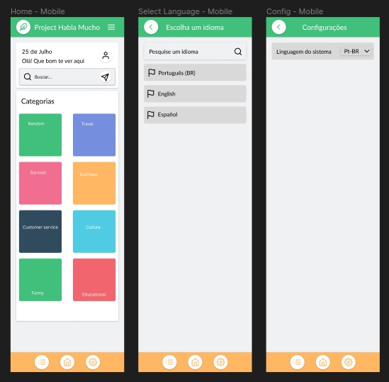

<h1 align="center"> Project HablaMucho </h1>

<p align="center">
Um projeto desenvolvido para aprendizado de novos idiomas feito com Next.js, Tailwind CSS e consumo de dados pelo Firebase, um banco de dados NoSQL.
</p>

<p align="center">
  <a href="#technologies">Tecnologias</a>&nbsp;&nbsp;&nbsp;|&nbsp;&nbsp;&nbsp;
  <a href="#project">Projeto</a>&nbsp;&nbsp;&nbsp;|&nbsp;&nbsp;&nbsp;
  <a href="#layout">Layout</a>&nbsp;&nbsp;&nbsp;|&nbsp;&nbsp;&nbsp;
  <a href="#license">Licença</a>
</p>

<p align="center">
  
</p>

<br>

<p align="center">
  
</p>

## 🚀 Tecnologias

<a id="technologies"></a>

Esse projeto foi desenvolvido com as seguintes tecnologias:

- HTML5, CSS3, JS ES6+
- [Node e Yarn](https://nodejs.org/)
- [Next.JS](https://nextjs.org/)
- [React.JS](https://reactjs.org/)
- [Create next-app](https://nextjs.org/docs/api-reference/create-next-app)
- [TypeScript](https://www.typescriptlang.org/)
- [Tailwind CSS](https://tailwindcss.com/)
- [Google Firebase](https://firebase.google.com/?hl=pt)

## 💻 Projeto

<a id="project"></a>

### Qual é o objetivo principal do sistema?

O objetivo principal do sistema de aplicação de línguas estrangeiras com diálogos mockados é proporcionar uma plataforma interativa e eficaz para o aprendizado de línguas estrangeiras por meio de diálogos simulados e práticos. A aplicação tem como meta facilitar o processo de aprendizagem de idiomas de forma envolvente, acessível e personalizada para os usuários, independentemente do nível de proficiência que possuam no idioma.

Os principais objetivos do sistema incluem:

1. **Aprendizagem Divertida e Interativa:** Oferecer uma experiência de aprendizado divertida, motivadora e interativa para os usuários, por meio de diálogos realistas que simulem situações do dia a dia. (✅)
2. **Prática de Habilidades Linguísticas:** Permitir que os usuários pratiquem suas habilidades linguísticas, como compreensão auditiva, leitura, pronúncia e expressão oral, de maneira prática e contextualizada. (⭕)
3. **Ampla Variedade de Línguas e Contextos:** Disponibilizar uma ampla variedade de línguas estrangeiras para os usuários escolherem, bem como diálogos em diferentes contextos, desde conversas informais até situações mais formais. (✅)
4. **Acesso a Traduções e Transcrições:** Facilitar a compreensão dos diálogos por meio de traduções e transcrições, ajudando os usuários a compreender o significado das palavras e frases em seus idiomas nativos. (⭕)
5. **Acompanhamento do Progresso:** Permitir que os usuários acompanhem seu progresso e desempenho ao longo do tempo, com estatísticas e indicadores que mostrem seu crescimento no aprendizado do idioma. (⭕)
6. **Flexibilidade e Personalização:** Oferecer flexibilidade aos usuários para escolherem os diálogos e línguas que desejam praticar, bem como adaptar a experiência de aprendizado de acordo com suas preferências e níveis de proficiência. (✅)
7. **Apoio a Diferentes Perfis de Usuários:** Atender a diferentes perfis de usuários, desde estudantes que desejam reforçar seu aprendizado em sala de aula até viajantes que buscam adquirir noções básicas de um idioma para suas viagens. (✅)
8. **Facilidade de Uso e Acesso Universal:** Proporcionar uma interface amigável e acessível, permitindo que os usuários acessem a aplicação em diferentes dispositivos, como computadores, tablets e smartphones. (✅)

✅ Implementado
⭕ Features futuras

### Quem serão os usuários do sistema?

1. **Estudantes de Línguas:** Pessoas interessadas em aprender ou aprimorar suas habilidades em línguas estrangeiras. Esses usuários podem ser estudantes que buscam reforçar o aprendizado de línguas em sala de aula ou autodidatas que desejam praticar diálogos de forma interativa.
2. **Viajantes:** Pessoas que planejam viajar para países onde se fala uma língua estrangeira e desejam adquirir noções básicas para se comunicar em situações cotidianas, como pedir informações ou fazer compras.
3. **Profissionais:** Profissionais que precisam aprender línguas estrangeiras para fins profissionais, como negócios, comunicação com colegas internacionais ou atendimento a clientes de outros países.
4. **Curiosos e Entusiastas:** Pessoas interessadas em aprender novos idiomas como hobby ou por interesse cultural. Esses usuários podem querer experimentar diferentes línguas apenas por diversão.
5. **Educadores e Professores:** Professores de línguas ou educadores que desejam utilizar a aplicação como uma ferramenta complementar em suas aulas ou para criar atividades interativas para seus alunos.

## 🏡 Comandos de execução no projeto

<a id="project"></a>

Instalação das dependências do projeto

```sh
yarn
```

Teste da aplicação em ambiente de desenvolvimento

```sh
yarn dev
```

## 🔖 Layout

<a id="layout"></a>

<p align="center">
  
</p>

Você pode visualizar o layout do projeto clicando [aqui](https://www.figma.com/file/9d4kIYr9YjwmRCHGv7O9gR/Project-Habla-Mucho?type=design&node-id=26%3A634&mode=design&t=BWskA3IieLK9ytOi-1). É necessário ter conta no [Figma](https://figma.com) para acessá-lo.

## 📝 Licença

<a id="license"></a>

Esse projeto está sob a licença MIT.
